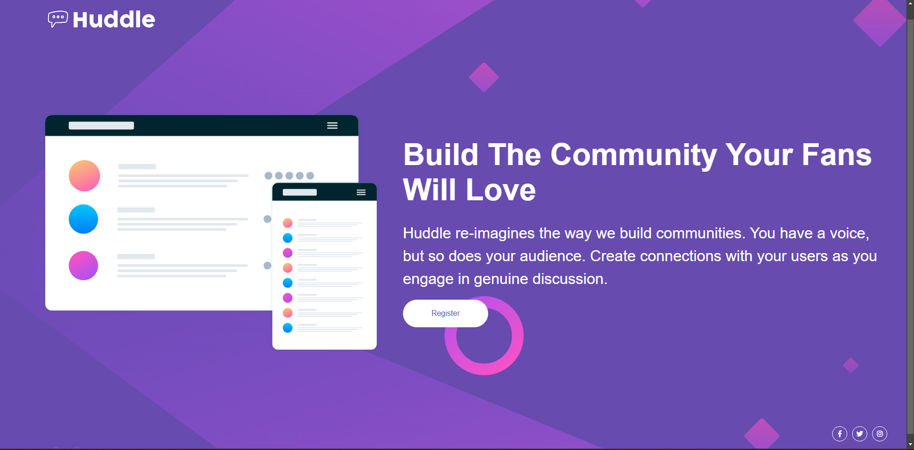

<!-- # Inserir informações do projeto aqui! -->

# Frontend Mentor - Huddle landing page with single introductory section solution
# DevQuest - Quest 1: Desafio CSS Avançado 1

Esta é a solução para a Quest 1 (Desafio CSS Avançado 1)

## Sumário

- [Visão Geral](#visão-geral)
  - [O Desafio](#o-desafio)
  - [Screenshot](#screenshot)
  - [Links](#links)
- [Meu Processo](#meu-processo)
  - [Conceitos e Ferramentas Utilizadas](#conceitos-e-ferramentas-utilizadas)
  - [Aprendizado](#aprendizado)
  - [Desenvolvimento Contínuo](#desenvolvimento-contínuo)
- [Autor](#autor)

## Visão Geral

### O Desafio

Usuários devem ser capazes de:

- Visualizar um layout otimizado para a página dependendo do tamanho de tela do dispositivo utilizado na navegação da página;
- Visualizar todos os estados hover para todos os elementos interativos na página.

### Screenshot



### Links

- Solução URL: [Add solution URL here](https://your-solution-url.com)

## Meu Processo

### Conceitos e Ferramentas Utilizadas

- Marcação HTML5 Semântica
- Propriedades Customizadas de CSS3
- CSS3 Flexbox
- Responsividade Desktop First

### Aprendizado

#### CSS3 Flexbox

Houve certas dificuldades de assimilar conhecimentos neste tópico em específico, dado que o projeto precisaria de uma otimização e refatoração de código.

#### Propriedades Customizadas de CSS3

Um dos maiores aprendizados neste desafio foi a inserção de background fixo conforme abaixo:

```css
body {
    background: url('../images/bg-desktop.svg') no-repeat center center fixed;
    background-size: cover;
    background-color: hsl(257, 40%, 49%);
}
```

Este insight permite novas ideias inovadoras para futuros projetos deste tipo.

#### Responsividade Desktop First

Ao aplicar a responsividade, foram encontradas algumas dificuldades na medição dos elementos. Por conta disso, são necessárias otimizações.

### Desenvolvimento Contínuo

Eis os conceitos dos quais necessitam maior atenção para futuros projetos:
- Propriedades Customizadas de CSS3
- CSS3 Flexbox
- Responsividade Desktop First

## Autor

- Github - [@Marcus-V-Couto](https://github.com/Marcus-V-Couto)
- Frontend Mentor - [@Marcus-V-Couto](https://www.frontendmentor.io/profile/Marcus-V-Couto)
